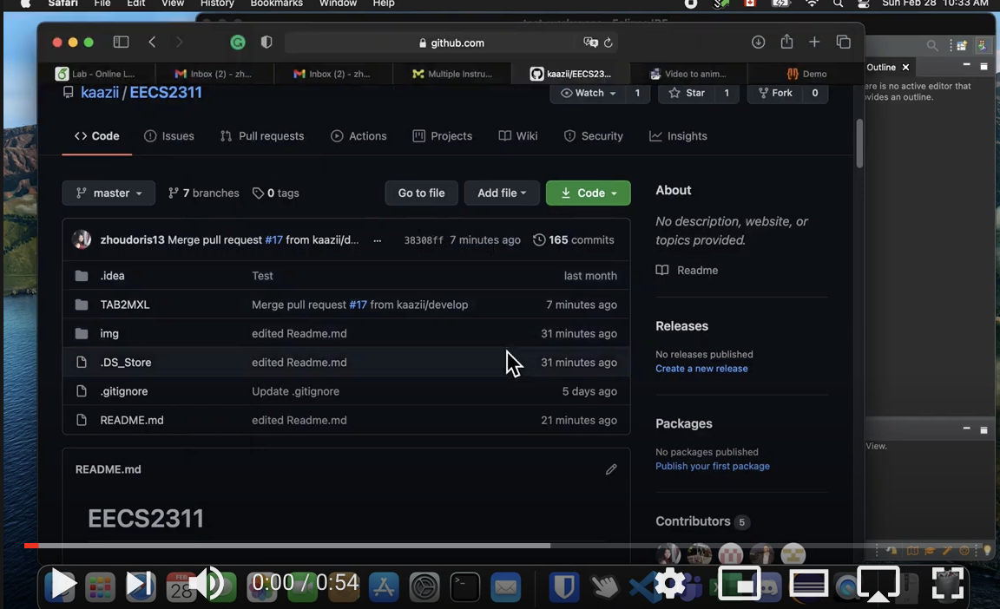

# EECS2311

## CC Attribution-ShareAlike 4.0 International
Shield: [![CC BY-SA 4.0][cc-by-sa-shield]][cc-by-sa]

This work is licensed under a
[Creative Commons Attribution-ShareAlike 4.0 International License][cc-by-sa].

[![CC BY-SA 4.0][cc-by-sa-image]][cc-by-sa]

[cc-by-sa]: http://creativecommons.org/licenses/by-sa/4.0/
[cc-by-sa-image]: https://licensebuttons.net/l/by-sa/4.0/88x31.png
[cc-by-sa-shield]: https://img.shields.io/badge/License-CC%20BY--SA%204.0-lightgrey.svg

## Design
[Figma Design](https://www.figma.com/file/ZYJ9E94dEMUY9RL5d5kadN/Untitled?node-id=0%3A1)

## Requirements
Latest version of Eclipse and Java JDK 15 must be installed.

## Documentation
[Requirements and Use Cases](documentation/SRS.pdf)

[User Manual](documentation/2311Group13_UserManual.pdf)

[Testing Document](documentation/2311Group13_TestingDocument.pdf)

[Design Document](documentation/2311Group13_DesignDocument.pdf)

## Access

Access instructions are entailed in this video:

## Helpful Links
[MusicXML Checker](https://www.soundslice.com/musicxml-viewer/)
