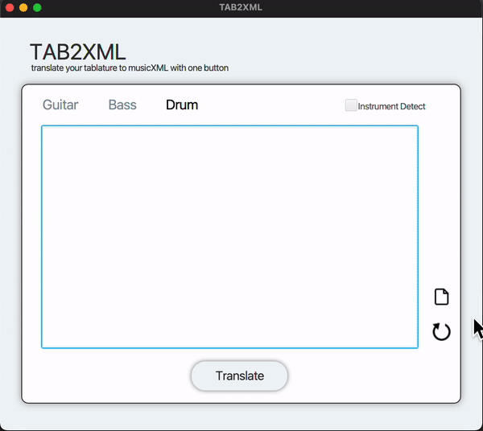
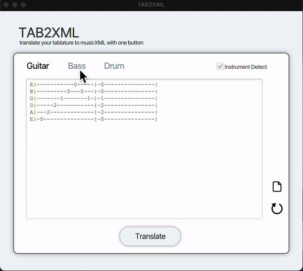
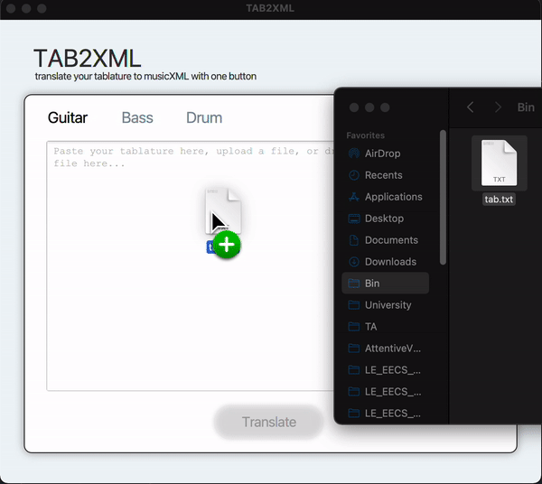
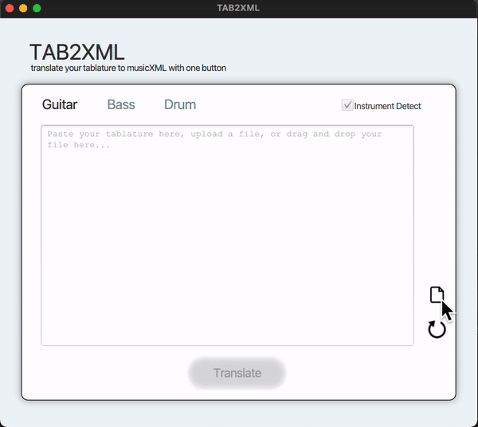
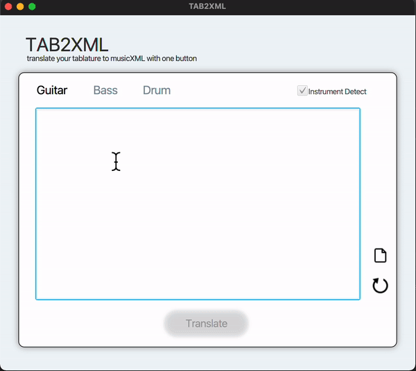
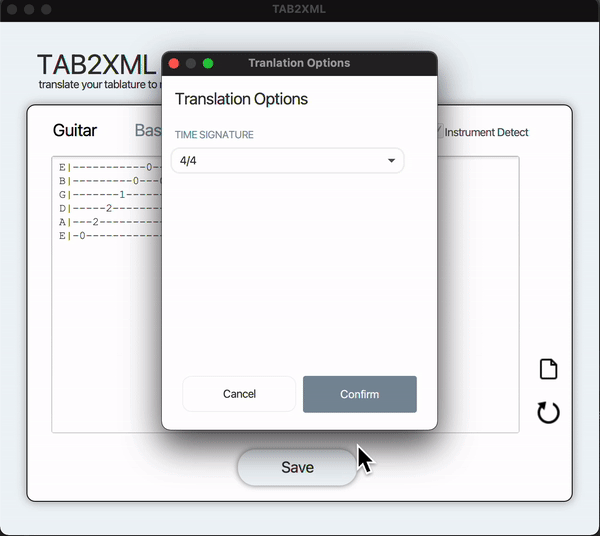
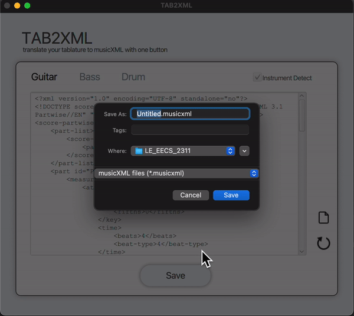

# EECS2311
## Design
[Figma Design](https://www.figma.com/file/ZYJ9E94dEMUY9RL5d5kadN/Untitled?node-id=0%3A1)


## Requirements
Latest version of Eclipse and Java JDK 15 must be installed.


## Current testable features
- Instrument detection 

- Instrument selection

- Drag and drop text files

- Upload files

- Text input

- Basic guitar tablature translation

- Saving transated .musicxml file on disk


## Access

## Sample Tablature
### Guitar tablature
```
E|-----------0-----|-0---------------|
B|---------0---0---|-0---------------|
G|-------1-------1-|-1---------------|
D|-----2-----------|-2---------------|
A|---2-------------|-2---------------|
E|-0---------------|-0---------------|
```
