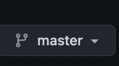
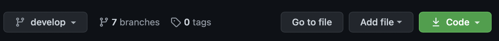
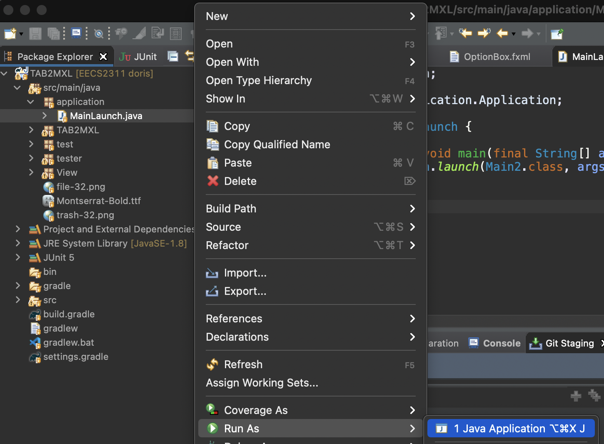

# EECS2311
## Design
[Figma Design](https://www.figma.com/file/ZYJ9E94dEMUY9RL5d5kadN/Untitled?node-id=0%3A1)

<br />

## Prototype Access through .jar
Access the prototype .zip file [here](https://drive.google.com/file/d/1iHCvr3aS85cOscXemlKNxHCu11FqEsMh/view?usp=sharing)

### How to access
- Download the .zip file from the link above. Unzip the downloaded file.
- Inside the unzipped folder, you will find the TAB2XML .jar file, two sub-directory javafx-sdk-11.0.2 and javafx-sdk-15.0.1, both contain JavaFX library files.
- Open a terminal or command prompt and navigate to the TAB2XML_GROUP13 folder
- Use this command ```java -jar --module-path "./javafx-sdk-11.0.2/lib" --add-modules javafx.controls,javafx.fxml TAB2XML.jar```
- You should be able to see the user interface of our prototype

### Troubleshooting
Due to version mismatch, you may see this error ```Graphics Device initialization failed for :  es2, sw```


To fix this error, follow the following steps:

1. Open a terminal. Check your Java version using this command ```java -version```
2. If the version is not Java 15, please modify your Java version. If it is set to Java 15, go to step 10.
3. If you are using Windows 10, here is a helpful tutorial: [How to switch Java versions in Windows (updated 09/2020 for Java 15)](https://www.happycoders.eu/java/how-to-switch-multiple-java-versions-windows/). After switching your Java version to Java 15, please go to step 10.
4. If you are using MacOS, use the following command in your terminal: ```/usr/libexec/java_home -V```
5. You should see something similar to this 
6. If Java 15 is not listed under the Java version, download and install from [Oracle](https://www.java.com/download)
7. Open a new terminal. Run the command in step 4 again, you should now see Java 15 listed under your Java home.
8. Run this command ``` export JAVA_HOME=`/usr/libexec/java_home -v 15.X.X` ```  Replace X.X with your Java 15 version.
9. Run ```java -version``` again to make sure your Java has successfully been changed to Java 15.
10. Run ```java -jar --module-path "./javafx-sdk-15.0.1/lib" --add-modules javafx.controls,javafx.fxml TAB2XML.jar```
11. You should be able to see the user interface of TAB2XML now. 

<br />

## Prototype access through repository
1. Switch to [doris](https://github.com/kaazii/EECS2311/tree/doris) branch from this drop down. 
2. Download the .zip from the green Code button.

3. Unzip the downloaded .zip file.
4. Open eclipse. File -> Import .. -> Existing project into workspace. Select the unzipped directory "EECS2311-develop"
5. Right clicked on the imported project -> Gradle -> Refresh Gradle Project
6. After the Gradle project is built, go to src/main/java, open application package, right click on MainLaunch.java -> Run As -> Java Application

7. Ignore the error warning.
8. You should be able to see our prototype.

## Sample Tablature
### Guitar tablature
```
E|-----------0-----|-0---------------|
B|---------0---0---|-0---------------|
G|-------1-------1-|-1---------------|
D|-----2-----------|-2---------------|
A|---2-------------|-2---------------|
E|-0---------------|-0---------------|
```
